# INSTRUCTIONS

### Prerequisites
- **git** (for cloning git repository)
- **VSCode**
- **XAMPP** (for SQL server)

# 

### If you prefer a Youtube Video, see this [MySQL Database to Visual Studio](https://www.youtube.com/watch?v=fU9ngotJz1w) video

#
### XAMPP Setup 
Open you XAMPP and Start **Apache** and **MySQL**:  

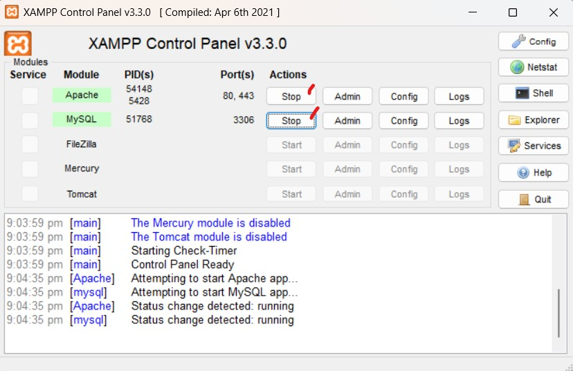  

Go to VSCode if it is already good and running.  

#
### VSCode Setup
Open your VSCode and go to `Extensions`:  

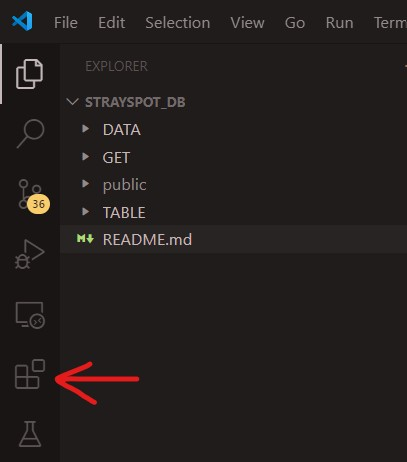


In the Search Bar type "**SQL**" and then find this (below) and install:  

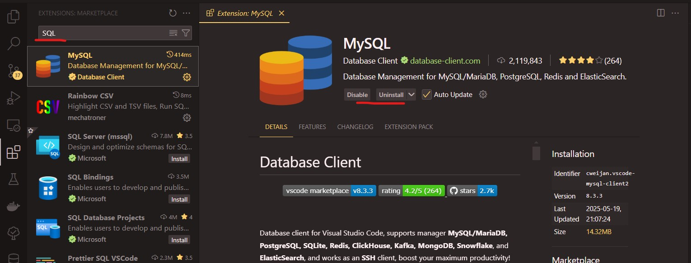

You are all good for now. Let's continue...   
#


### Database Connection
After installing the Extension you should see this in your left side bar:  

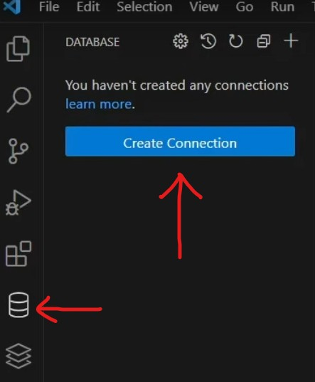

Click **Create Connection**

**Clicking will trigger this configuration to appear:**  

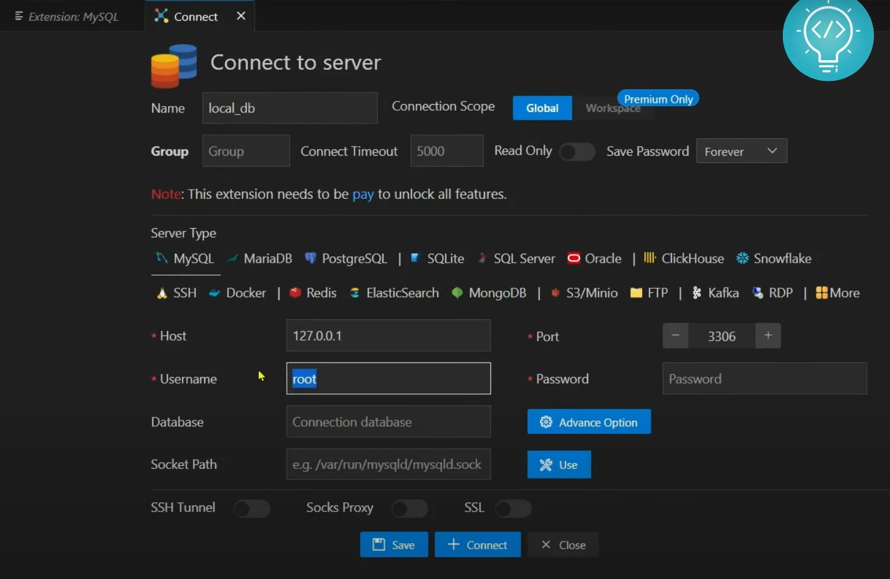

You can just follow everything in the image.

**After that you should be able to see something like this:**  

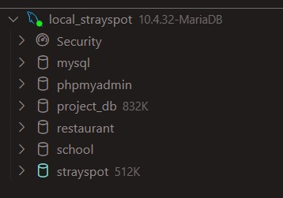  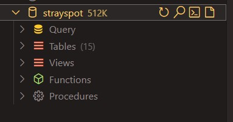  
*this displays the available databases in your XAMPP. To create new database just hover the server name (in the image is local_strayspot), you should be able to see a plus icon.*

> [!NOTE]  
> See the expanded database **strayspot**. Please be familiar with the Query and Tables (as you can see in the image above).

#
### Clone the Repository

```bash
git clone https://github.com/nylla8444/CC205-IM-Finals.git
```

**After cloning, navigate again to the Database Extension in the left side bar.**  

> [!NOTE]  
> **CREATE TABLE** commands are inside **`TABLE`** folder  
> **INSERT INTO** commands are inside  **`DATA`** folder  
> **SQL Queries** are inside **`GET`** folder  

*GET because we are getting something from our DB*

#
### Populate Code into Server
Navigate in your database and expand the Query:  
  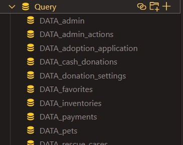  

**To add query, click the plus icon in the right side of Query** 

#
### Now, create each file inside query.
For proper naming conventions, do this:
- **`TABLE_file_name`** = for TABLE creation commands 
- **`DATA_file_name`** = for INSERT data commands    
- **`GET_file_name_query`** = for SQL Query commands

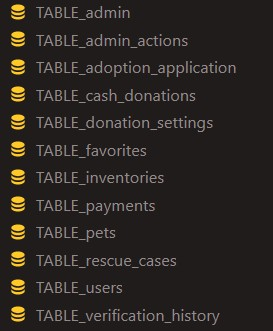 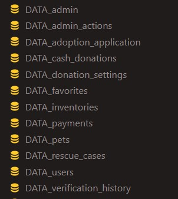 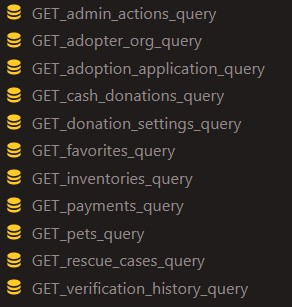  


> [!IMPORTANT]  
> See this adding of [files sequence](#file-sequence) to avoid error 

# 
### How to Run Commands
Easy, just press **run**:  

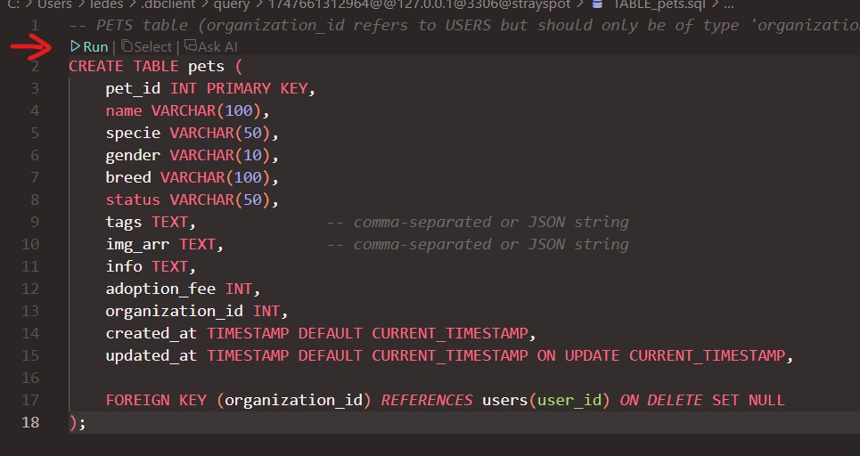  

> [!NOTE]  
> If there are 2 or more commands in a single file, just run it from top to bottom.

#
### How to View Tables
Just expand the Tables, like this:  

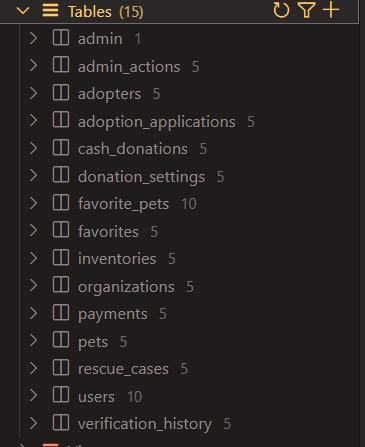  

**Just click specific table to view**

#
### How to Generate Document (not full table tho)
**Right Click** your database's name and select **Generate Document**  

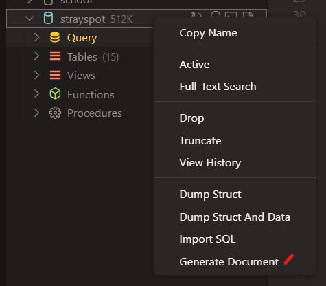


#

#

#

## FILE SEQUENCE
Follow the creation of file sequence below to avoid any errors (for safety only).  

```bash
TABLE_users
DATA_users
GET_adopter_organization_query
```
```bash
TABLE_pets
DATA_pets
GET_pets_query
```

```bash
TABLE_admin
DATA_admin
```

```bash
TABLE_admin_actions
DATA_admin_actions
GET_admin_actions_query
```

```bash
TABLE_adoption_application
DATA_adoption_application
GET_adoption_application_query
```

```bash
TABLE_cash_donations
DATA_cash_donations
GET_cash_donations_query
```

```bash
TABLE_donation_settings
DATA_donation_settings
GET_donation_settings_query
```

```bash
TABLE_favorites
DATA_favorites
GET_favorites_query
```

```bash
TABLE_inventories
DATA_inventories
GET_inventories_query
```

```bash
TABLE_payments
DATA_payments
GET_payments_query
```

```bash
TABLE_rescue_cases
DATA_rescue_cases
GET_rescue_cases_query
```

```bash
TABLE_verification_history
DATA_verification_history
GET_verification_history_query
```


> [!NOTE]
> There should be a total of 15 Tables.   

 